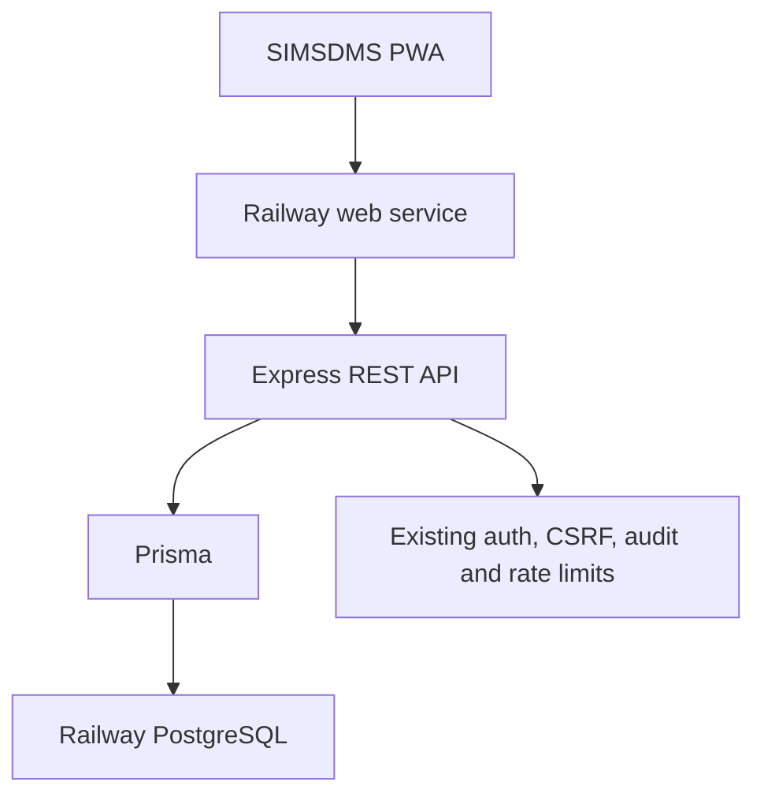
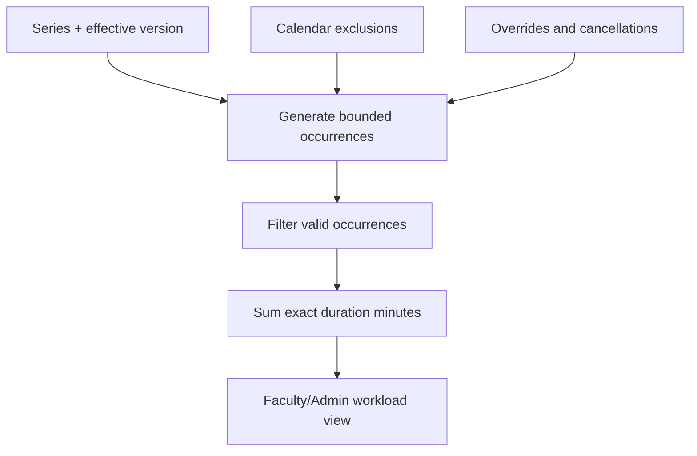
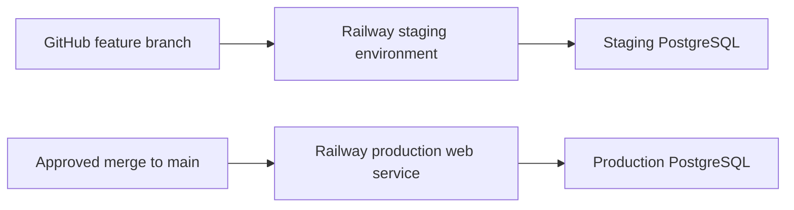

# Spec 042 — Integration Architecture

Status: **proposed architecture for implementation**  
Authority: [`042-spec.md`](042-spec.md) plus the repository `CONSTITUTION.md`, `docs/UI_ARCHITECTURE.md` and `docs/MOBILE_PATTERNS.md`

## 1. Architecture decision

Integrate this module into the current SIMSDMS monolith.



The first release uses one repository, one web service and one database. It does not add a second application runtime.

### Why

- SIMSDMS already has the required users, roles, authentication, responsive shell, shared UI, logging and audit foundations.
- The expected scale is one college and approximately 20–30 faculty.
- Timetable and workload transactions need strong consistency with the same user and academic records.
- The project Constitution explicitly locks Express, Prisma, PostgreSQL, REST and a monolithic single-deploy structure.
- A second framework/service would duplicate authentication, authorization, CSRF, monitoring, deployment and data ownership without providing a current scale benefit.

## 2. Constitution amendment required first

The approved timetable rule is:

> Faculty own their schedules. Admin and Super Admin may manage academic master data and view all schedules/workloads, but may not edit, cancel or stop faculty timetable entries.

This conflicts with the current broad Super Admin wording. Before code work:

1. Add Faculty Timetable and Workload permissions to the existing role sections.
2. Add the timetable ownership exception to Super Admin permissions.
3. Add recurrence, conflict, workload and history rules to Core Business Rules.
4. Add the new data entities to the schema section.
5. Add the module to the implementation/version history.

No new role is introduced.

## 3. Frontend integration

### 3.1 Routes

Add these page routes to `client/src/App.jsx` and constants to `client/src/utils/constants.js`:

| Role | Route | Page |
| --- | --- | --- |
| Faculty | `/faculty/timetable` | Weekly timetable and faculty workload |
| Admin/Super Admin | `/admin/timetable` | Read-only all-faculty timetable/workload |
| Admin/Super Admin | `/admin/academics` | Academic master data management |

The initial faculty page can use tabs or segmented views for **Timetable** and **Workload**. Do not create a separate frontend application.

### 3.2 Navigation

- Add **Timetable** under a new or existing Faculty `Academics` sidebar group.
- Add **Timetable** and **Academic Setup** to Admin navigation.
- Add a faculty dashboard quick action to `/faculty/timetable`.
- Keep the current four pinned faculty bottom tabs unchanged in the first release. Replacing a tab requires a separate owner decision after live mobile review.

### 3.3 Proposed frontend structure

```text
client/src/
├── pages/
│   ├── faculty/FacultyTimetablePage.jsx
│   └── admin/
│       ├── AdminTimetablePage.jsx
│       └── AcademicSetupPage.jsx
├── components/timetable/
│   ├── WeeklyTimetable.jsx
│   ├── TimetableDayList.jsx
│   ├── TimetableEntryCard.jsx
│   ├── TimetableEntrySheet.jsx
│   ├── TimetableActionMenu.jsx
│   ├── WorkloadSummary.jsx
│   └── WorkloadBreakdown.jsx
├── hooks/
│   ├── useAcademicOptions.js
│   ├── useTimetable.js
│   └── useWorkload.js
└── services/
    ├── academic.service.js
    ├── timetable.service.js
    └── workload.service.js
```

Names may be adjusted to match the repository's actual local convention during implementation; responsibilities should remain separated.

### 3.4 UI system boundary

Use existing shared components and patterns:

- `Layout` and `PageHeader`
- `ResponsiveSheet` for Add/Edit Class
- `AppButton`
- existing Mantine form primitives wrapped by local helpers
- `ConfirmDialog` for Cancel Today and Delete Schedule
- existing Alert, Toast, loading, empty and error states
- Tabler icons

Feature pages must not import Radix or Framer Motion directly. Avoid a third-party calendar library for the first version; the required Monday–Saturday view can be built with repository-native layout primitives and will be easier to make accessible on mobile.

### 3.5 Query behavior

- Use TanStack Query for all server state.
- Weekly timetable query key includes actor scope, week start and filters.
- Invalidate only affected timetable/workload ranges after mutation.
- Keep the repository default 30-second stale/polling approach where live freshness is useful.
- Optimistic creation/edit is not required; conflict validation is authoritative on the server, so show a pending state and update only after success.

## 4. Backend integration

### 4.1 Route registration

Add route modules to `server/index.js`:

```text
/api/academics
/api/timetable
/api/workload
```

The exact existing API prefix from `server/index.js` must be preserved. All mutations pass through the existing authentication, CSRF and rate-limit middleware.

### 4.2 Proposed backend structure

```text
server/
├── routes/
│   ├── academics.routes.js
│   ├── timetable.routes.js
│   └── workload.routes.js
├── controllers/
│   ├── academics.controller.js
│   ├── timetable.controller.js
│   └── workload.controller.js
├── schemas/
│   ├── academics.schema.js
│   └── timetable.schema.js
├── services/
│   ├── academic-options.service.js
│   ├── timetable-occurrence.service.js
│   ├── timetable-conflict.service.js
│   └── workload.service.js
└── lib/
    └── timetable-time.js
```

Controllers should coordinate HTTP concerns only. Recurrence expansion, conflict detection and workload calculation belong in reusable services so API tests do not depend on UI behavior.

### 4.3 Authorization boundary

- Faculty mutation controllers derive ownership from the authenticated user; they do not accept a trusted `faculty_id`.
- A faculty read may request only their own data.
- Admin/Super Admin read endpoints accept faculty filters.
- Academic master-data mutations accept Admin/Super Admin.
- Timetable mutation endpoints accept Faculty only, even for Super Admin.
- Series/version/override lookup always includes ownership in the query before mutation.

### 4.4 Recurrence expansion

Do not pre-create an unbounded row for every future week. Generate occurrences for a requested bounded date range from:

1. the active series;
2. the effective version for each date;
3. calendar exclusions;
4. occurrence overrides/cancellations.

The API caps date ranges. Recommended limits:

- timetable: maximum 8 weeks per request;
- workload detail: maximum 366 days per request;
- administrative aggregate: maximum 366 days with pagination/drill-down.

This avoids an infinite occurrence table while preserving exact historical versions.

### 4.5 Transactional conflict protection

Every create, edit-one or edit-future mutation must:

1. validate academic and activity rules;
2. compare recurring weekday/time rules across their complete overlapping effective-date ranges, so a future clash is not missed by an arbitrary look-ahead window;
3. resolve date-specific overrides/exclusions when a potential rule overlap depends on particular dates;
4. acquire a deterministic database transaction guard for the affected faculty, section/batch and location resources;
5. query overlapping effective entries using `[start, end)` rules;
6. write the series/version/override and audit event in the same transaction;
7. commit or return `409 TIMETABLE_CONFLICT`.

Prisma alone cannot express every exclusion constraint for generated recurrences. The implementation spike should select one of these PostgreSQL-safe approaches:

- serializable transaction plus bounded retry; or
- transaction-scoped advisory locks keyed by resource/date, with documented raw SQL limited to this complex consistency boundary.

The selected approach must have a parallel-request integration test. A client precheck is insufficient.

### 4.6 Time handling

- Store recurring day as an enum and time as integer minutes after midnight.
- Store effective/occurrence dates using PostgreSQL `date`.
- Interpret all academic schedule dates in `Asia/Kolkata`.
- Convert dates at the API boundary using one tested helper; do not use the server machine's local timezone implicitly.
- Audit timestamps remain UTC `DateTime`.

## 5. Workload query architecture

Workload is derived, not independently edited.



For the expected scale, on-demand calculation with indexed queries is preferred over a separate materialized workload store. Add caching/materialization only after measured staging evidence shows it is necessary.

Status is computed at response time:

- `completed` when occurrence end is before now;
- `scheduled_now` when now is within `[start, end)`;
- `upcoming` when start is after now;
- `cancelled` only for history views.

No background job is needed for status changes.

## 6. Audit integration

Use a timetable-specific append-only audit table for domain history. Also write a concise event to the existing Admin audit mechanism when an Admin/Super Admin changes academic master data.

Faculty timetable audit history should not be forced into violation-specific tables. Audit creation must be part of the same transaction as the timetable mutation.

## 7. Railway topology

### 7.1 First release



- Keep one existing production web service.
- Use a separate Railway staging environment and staging database for QA.
- Do not use production data or credentials in staging.
- Do not merge to `main` until staging gates pass because the repository's production deployment follows the main branch.

### 7.2 Later reminders, only after approval

If Telegram timetable reminders are restored to scope, add a dedicated worker entry point, for example `server/worker.js`, as another Railway service from the same repository and database.

Do not clone the current web service unchanged: `server/index.js` starts existing cron jobs, so multiple identical web instances can duplicate jobs. The worker design must include database-backed claiming/deduplication and an idempotency key for each notification.

## 8. Observability

Add structured logs for:

- mutation outcome and latency;
- conflict category, excluding private entry content;
- workload query range and duration;
- recurrence expansion count;
- transaction retry count;
- academic master mutation actor and target ID.

Add health/readiness verification after migration. Do not log full request cookies, JWTs, CSRF tokens or sensitive user data.

## 9. Architecture non-goals

- No microservices.
- No GraphQL, WebSockets or SSE.
- No separate timetable database.
- No Laravel/Inertia/Vue runtime.
- No event bus.
- No pre-generated infinite occurrences.
- No third-party hosted calendar dependency.
- No production deployment from an unreviewed planning branch.
