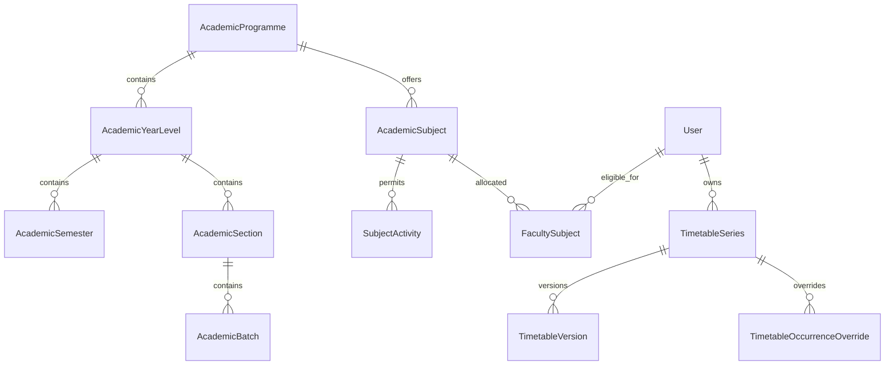

# Spec 042 — Data Model and Recurrence Design

Status: **proposed Prisma/PostgreSQL model**  
This document defines domain ownership and constraints. Field names may receive minor Prisma-style adjustments during implementation, but the relationships and invariants are acceptance requirements.

## 1. Data ownership decision

Create normalized academic timetable tables. Do not overload:

- `User.department`, which is currently free text;
- `Student.course`, `Student.year` or `Student.semester`;
- the duty `CalendarConfig`;
- duty slots, attendance or violation audit tables.

Existing student fields remain backward-compatible. A later, separately planned migration may link students to academic master IDs.

## 2. Entity overview



## 3. Enums

Recommended Prisma enums:

```prisma
enum ProgrammeCode {
  b_pharm
  pharm_d
}

enum TimetableActivityType {
  theory
  tutorial
  practical
  library
  sports
  internship_duty
}

enum TimetableDayOfWeek {
  monday
  tuesday
  wednesday
  thursday
  friday
  saturday
}

enum TimetableAudienceType {
  whole_section
  batch
  internship
}

enum OccurrenceOverrideType {
  modified
  cancelled
}

enum TimetableAuditAction {
  created
  occurrence_edited
  future_edited
  occurrence_cancelled
  series_stopped
}
```

Sunday is deliberately absent.

## 4. Academic master entities

### 4.1 `AcademicDepartment`

| Field | Type/constraint |
| --- | --- |
| `id` | UUID primary key |
| `name` | varchar(150), unique among active records |
| `code` | varchar(30), unique |
| `is_active` | boolean default true |
| timestamps | created/updated |

Initial deployment may use one Pharmacy department, but the hierarchy remains explicit.

### 4.2 `AcademicProgramme`

| Field | Type/constraint |
| --- | --- |
| `id` | UUID primary key |
| `department_id` | FK Department |
| `code` | `ProgrammeCode`, unique |
| `name` | B.Pharm or Pharm.D |
| `year_count` | 4 or 6 |
| `uses_semesters` | true only for B.Pharm |
| `is_active` | boolean |

Add check constraints in the migration for valid code/year/semester combinations.

### 4.3 `AcademicYearLevel`

| Field | Type/constraint |
| --- | --- |
| `id` | UUID primary key |
| `programme_id` | FK Programme |
| `year_number` | smallint |
| `label` | varchar(50) |
| `is_active` | boolean |

Unique: `(programme_id, year_number)`.

### 4.4 `AcademicSemester`

| Field | Type/constraint |
| --- | --- |
| `id` | UUID primary key |
| `year_level_id` | FK YearLevel |
| `semester_number` | smallint, 1–8 |
| `label` | varchar(30) |
| `is_active` | boolean |

Exists only for B.Pharm. Unique: `(year_level_id, semester_number)`.

### 4.5 `AcademicSection`

| Field | Type/constraint |
| --- | --- |
| `id` | UUID primary key |
| `year_level_id` | FK YearLevel |
| `semester_id` | nullable FK Semester; required for B.Pharm, null for Pharm.D |
| `name` | e.g. A, B |
| `academic_year` | varchar(10), e.g. 2026-27 |
| `is_active` | boolean |

Unique active identity: `(year_level_id, semester_id, name, academic_year)` with null-safe handling in SQL migration.

### 4.6 `AcademicBatch`

| Field | Type/constraint |
| --- | --- |
| `id` | UUID primary key |
| `section_id` | FK Section |
| `name` | custom value such as Batch 1 or A1 |
| `sort_order` | integer |
| `is_active` | boolean |

Unique: `(section_id, name)`.

### 4.7 `AcademicSubject`

| Field | Type/constraint |
| --- | --- |
| `id` | UUID primary key |
| `programme_id` | FK Programme |
| `year_level_id` | FK YearLevel |
| `semester_id` | nullable FK Semester |
| `code` | varchar(50) |
| `name` | varchar(200) |
| `is_active` | boolean |

Unique: `(programme_id, code, semester_id)` with null-safe handling. Shared subjects across sections reuse the same subject row.

### 4.8 `SubjectActivity`

| Field | Type/constraint |
| --- | --- |
| `id` | UUID primary key |
| `subject_id` | FK Subject |
| `activity_type` | Theory/Tutorial/Practical/Library only |
| `is_active` | boolean |

Unique: `(subject_id, activity_type)`. Sports and Internship Duty are not subject activities.

### 4.9 `FacultySubject`

| Field | Type/constraint |
| --- | --- |
| `id` | UUID primary key |
| `faculty_id` | FK `User` |
| `subject_id` | FK Subject |
| `is_active` | boolean |
| `created_by` | FK User, Admin/Super Admin |
| timestamps | created/updated |

Unique: `(faculty_id, subject_id)`. Application validation requires the target user to be active Faculty.

### 4.10 `ClassroomLocation`

| Field | Type/constraint |
| --- | --- |
| `id` | UUID primary key |
| `name` | varchar(150) |
| `code` | nullable varchar(50) |
| `capacity` | nullable integer |
| `is_active` | boolean |

Unique active code/name as appropriate. Every timetable entry requires a location.

## 5. Timetable entities

### 5.1 `TimetableSeries`

Stable identity and ownership of a recurring schedule.

| Field | Type/constraint |
| --- | --- |
| `id` | UUID primary key |
| `faculty_id` | FK User; immutable owner |
| `created_at` / `updated_at` | timestamps |

Do not put mutable schedule details here; they belong to versions.

### 5.2 `TimetableVersion`

Effective-dated recurring rule.

| Field | Type/constraint |
| --- | --- |
| `id` | UUID primary key |
| `series_id` | FK Series |
| `effective_from` | date |
| `effective_to` | nullable date, inclusive; null means open-ended |
| `programme_id` | FK Programme |
| `year_level_id` | FK YearLevel |
| `semester_id` | nullable FK Semester |
| `section_id` | FK Section |
| `subject_id` | nullable FK Subject |
| `activity_type` | TimetableActivityType |
| `audience_type` | whole_section/batch/internship |
| `batch_id` | nullable FK Batch |
| `internship_duty_name` | nullable varchar(200) |
| `day_of_week` | Monday–Saturday enum |
| `start_minutes` | smallint, 0–1439 |
| `end_minutes` | smallint, 1–1440; greater than start |
| `location_id` | FK ClassroomLocation |
| `created_by` | FK User, equal to series faculty owner |
| `created_at` | timestamp |

Constraints:

- versions for a series do not have overlapping effective ranges;
- B.Pharm requires semester; Pharm.D requires null semester;
- Theory/Tutorial => subject required, whole-section, batch null;
- Practical => subject required, batch audience, exactly one batch;
- Library => subject optional, batch audience, exactly one batch;
- Sports => subject null, batch audience, exactly one batch;
- Internship Duty => Pharm.D Year 6, subject/batch/semester null, duty name required;
- `end_minutes > start_minutes`;
- location required.

Use database check constraints in the SQL migration where Prisma schema syntax cannot fully encode these invariants.

### 5.3 `TimetableOccurrenceOverride`

One date-specific cancellation or modification.

| Field | Type/constraint |
| --- | --- |
| `id` | UUID primary key |
| `series_id` | FK Series |
| `occurrence_date` | date |
| `override_type` | modified/cancelled |
| modified schedule fields | nullable; complete replacement snapshot for `modified` |
| `reason` | nullable varchar(500) |
| `created_by` | FK User, series owner |
| timestamps | created/updated |

Unique: `(series_id, occurrence_date)`. A modified override stores a complete effective occurrence snapshot, not a fragile partial patch.

### 5.4 `AcademicCalendarExclusion`

| Field | Type/constraint |
| --- | --- |
| `id` | UUID primary key |
| `name` | varchar(200) |
| `start_date` / `end_date` | inclusive dates |
| scope IDs | nullable programme/year/semester/section FKs |
| `created_by` | FK Admin/Super Admin |
| `is_active` | boolean |
| timestamps | created/updated |

Null scope means institution-wide. More specific scope applies only to matching occurrences. `end_date >= start_date`.

### 5.5 `TimetableAuditLog`

| Field | Type/constraint |
| --- | --- |
| `id` | UUID primary key |
| `series_id` | FK Series |
| `version_id` | nullable FK Version |
| `override_id` | nullable FK Override |
| `action` | TimetableAuditAction |
| `actor_id` | FK User |
| `actor_role` | existing Role enum snapshot |
| `effective_date` | nullable date |
| `before_data` / `after_data` | nullable JSON snapshots |
| `reason` | nullable varchar(500) |
| `created_at` | timestamp |

No update/delete application path is exposed for this table.

## 6. Required indexes

At minimum:

- `TimetableSeries(faculty_id)`
- `TimetableVersion(series_id, effective_from, effective_to)`
- `TimetableVersion(day_of_week, start_minutes, end_minutes)`
- `TimetableVersion(section_id, day_of_week, start_minutes)`
- `TimetableVersion(batch_id, day_of_week, start_minutes)`
- `TimetableVersion(location_id, day_of_week, start_minutes)`
- `TimetableOccurrenceOverride(series_id, occurrence_date)` unique
- `AcademicCalendarExclusion(start_date, end_date, is_active)`
- academic option foreign keys plus `is_active`
- `FacultySubject(faculty_id, is_active)`
- `TimetableAuditLog(series_id, created_at)`

Validate actual query plans on staging before changing or adding compound indexes.

## 7. Occurrence resolution algorithm

For each requested date:

1. Select active series whose weekday has a version effective on the date.
2. Select the one version whose effective range contains the date.
3. Suppress the occurrence when an active calendar exclusion matches.
4. Apply the unique occurrence override:
   - cancelled => return only for history mode;
   - modified => replace the version snapshot.
5. Compute local start/end instants in `Asia/Kolkata`.
6. Compute schedule status and `duration_minutes`.

The same resolver must serve timetable reads, conflict checking and workload calculations to prevent three definitions of an occurrence.

## 8. Versioning examples

### Edit all future

If a Wednesday 10:00 class effective from 2026-09-01 is changed starting 2026-10-07:

- old version `effective_to = 2026-09-30`;
- new version `effective_from = 2026-10-07`;
- no version is created for dates that are not the series weekday;
- historical September occurrences resolve from the old version.

### Delete schedule

If the same series is stopped beginning 2026-11-04:

- active version `effective_to = 2026-10-28`;
- no future version exists;
- September/October history remains.

## 9. Seed strategy

Create idempotent synthetic seeds for:

- one Pharmacy department;
- B.Pharm years 1–4 and semesters 1–8;
- Pharm.D years 1–6 without semesters;
- sample sections/batches, locations and subjects;
- permitted subject activities;
- eligible synthetic faculty-subject rows.

Do not commit real faculty names, real subject allocations or production schedules. Production master data is entered or imported through authorized operational steps after migration.

## 10. Migration safety

- All new tables are additive; do not rewrite existing Student/User data in the first migration.
- Generate and review Prisma migration SQL before applying.
- Add check constraints and null-safe unique indexes explicitly where Prisma cannot express them.
- Apply to staging with backup/restore verification first.
- Confirm Prisma client generation and existing server tests before any seed or UI work.
- Rollback is application-first: stop new writes, deploy prior code, then restore/drop additive tables only under an approved database rollback procedure.

